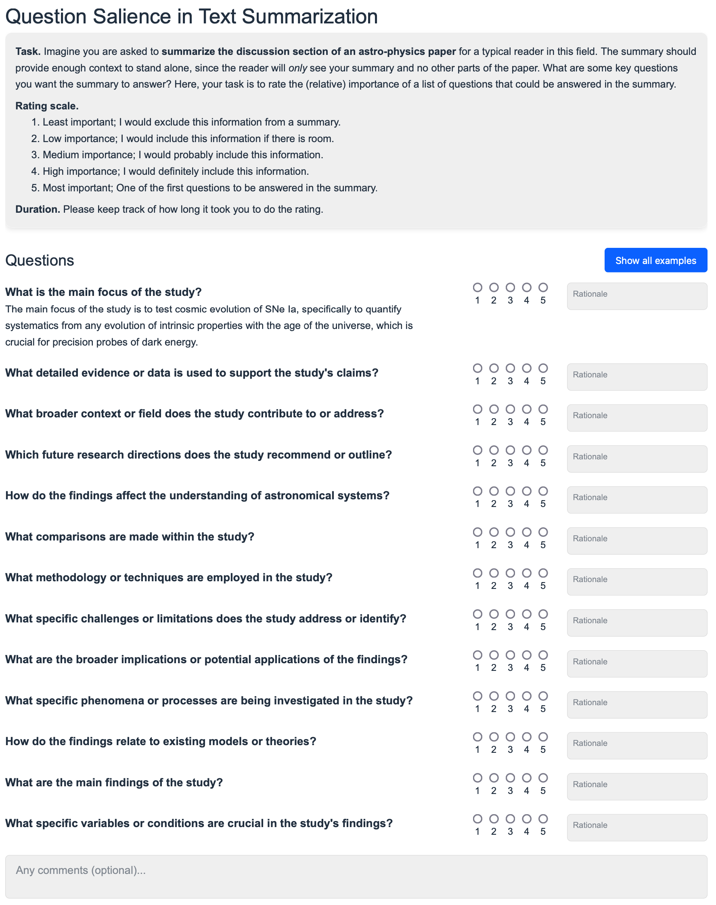

# Question Salience Annotation

A Vue.js server-less interface to let domain experts annotate question salience. 
For more information, please refer to this repository: https://github.com/jantrienes/llm-salience

## Demo

https://jantrienes.com/qa-salience-annotation/?dataset=pubmed-sample&annotator=foo



## Development

```sh
# Project Setup
npm install

# Compile and Hot-Reload for Development
npm run dev

# Compile and Minify for Production
npm run build

# Lint
npm run lint
```
